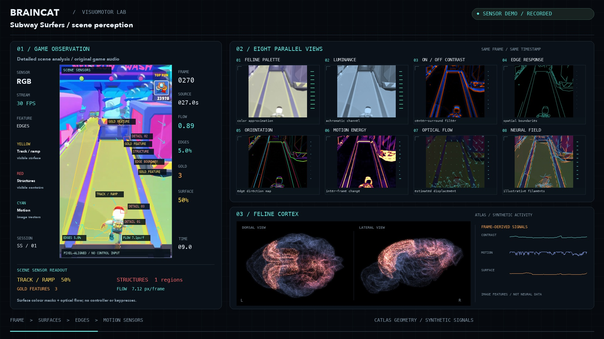

# CatBrain × Subway Surfers

An image-driven research project: game frames enter a visual encoder, a feline cortical-area network maintains state, and a future trained controller chooses game actions.



*Visual target from the current 60-second demonstration. Its overlays are computed image features; the animated cortex is illustrative. The starter below runs offline and does not yet play the game.*

## Start

Python 3.11+ on macOS or Linux. Use a checkout and an editable installation so the compact data bundle remains beside the code.

```sh
python3 -m venv .venv
source .venv/bin/activate
pip install -e .
python -m catbrain prepare
python -m catbrain replay
```

The bundled five-second clip needs no account. `prepare` verifies the included assets; no large download is required. `replay` writes frame timestamps, image features, 65 area-state values and a final checkpoint under `runs/replay/`. It never sends keyboard input. The checkpoint is an inspection artifact; automatic resume is not implemented yet.

```sh
python -m catbrain replay --video /path/to/gameplay.mp4 --frames 900 --out runs/session-01
```

Supply a portrait game capture, cropped to the playfield. The current feature encoder uses the full supplied frame, including any HUD.

## Included data

| File | Purpose |
| --- | --- |
| `data/cat-cortex.graphml` | NeuroData's cat entry: 65 area nodes, 1,139 directed edges from tract-tracing literature. Original IDs and direction retained. |
| `data/brain.json` + `brain.bin` | Compact CATLAS-derived cortical geometry for the future viewer. 74 atlas labels split into 148 display pieces. |
| `data/gameplay-sample.mp4` | Five seconds of the supplied recording, original audio, resized to 320 × 552. An input fixture, not a labeled training dataset. |
| `data/manifest.json` | Provenance, sizes and SHA-256 locks. |
| `assets/demo.jpg` | Demonstration image shown above. |

This is an area-level graph, **not a cat synaptic connectome**. The graph has no reliable region-name mapping to the 74 CATLAS labels. The atlas is a separate display asset; do not silently match its surfaces to graph node numbers.

## Implementation roadmap

### 1. Reproducible visual input — included

Decode recorded frames with their timestamps. Extract an 8 × 8 luminance grid plus inter-frame change. Feed these 65 values through a seeded input projection into a normalized directed area graph. Save every observation and final state. The starter's bounded rate dynamics and input projection are engineering choices, not measured cat physiology.

### 2. Learn a visual representation

Record multiple runs with synchronized frames and real actions: `none`, `left`, `right`, `jump`, `roll`. Keep entire runs together when splitting training, validation and evaluation data. Add lanes, obstacle masks and ramp annotations to a small manually reviewed subset. Existing videos alone do not provide reliable keypress labels.

Start with a conventional image encoder baseline. A separate research branch can fit a visual-response encoder using [CRCNS pvc-3](https://crcns.org/data-sets/vc/pvc-3/about/), then freeze and evaluate it on held-out stimuli before transferring to game frames. This dataset's evoked recordings contain 10 simultaneously recorded cat area-17 cells, not a whole visual system. Raw CRCNS files are **not bundled**: obtain them through the provider's access process. Generalization to gameplay and expanding local receptive fields across the screen both require validation.

### 3. Train the controller

Train an action readout from temporal network state using synchronized demonstration actions. The controller must receive visual information through the chosen encoder/network path, without a bypass from raw frames. Add a game adapter only after offline replay works. Reward survival progress and penalize collisions in a reproducible local environment; record resets and timing. Do not infer rewards or keypresses from decorative overlays.

### 4. Connect live gameplay

Add frame capture, monotonic timestamps, an action queue, cooldowns, a pause/stop switch and a no-input dry run. Measure capture-to-action latency separately from simulation time. Log proposed and actually executed actions. Add checkpoint restoration including previous visual state, recurrent state, controller weights and frame position.

### 5. Build the viewer

Recreate the demonstration with the main game feed, frame-aligned contours, eight visual panels and CATLAS geometry. Show measured image signals separately from synthetic activity. Synchronize gameplay sound from the same source timestamps. The screenshot is the presentation target, not proof of a learned policy.

### 6. Evaluate the contribution

Use unseen runs and several fixed seeds. Compare an ordinary encoder/controller, the same controller with the area graph, and a version with the fitted visual-response encoder. Include frozen, shuffled-graph and reset-state controls. Report collisions per run, distance, action accuracy, frame drops and end-to-end latency under equal compute budgets. No improvement or biological reaction-time advantage is claimed yet.

## Project structure

The starter intentionally has one small runtime module, one check module, one CI workflow and five compact data/display artifacts. No fly connectome, trading SDK, large model weights or duplicate videos are included.

The engineering pattern follows [Stonkfly](https://github.com/nftechie/stonkfly): verified inputs, a visible sensory path, explicit readout boundaries and local run artifacts. The fly's cell model, dopamine assignments and trading rules are not transferred to a cat. Reference revision: `78ef3e05ab0fa086032098558d893667068944a0`.

See [THIRD_PARTY.md](THIRD_PARTY.md) for provenance and data limitations.
